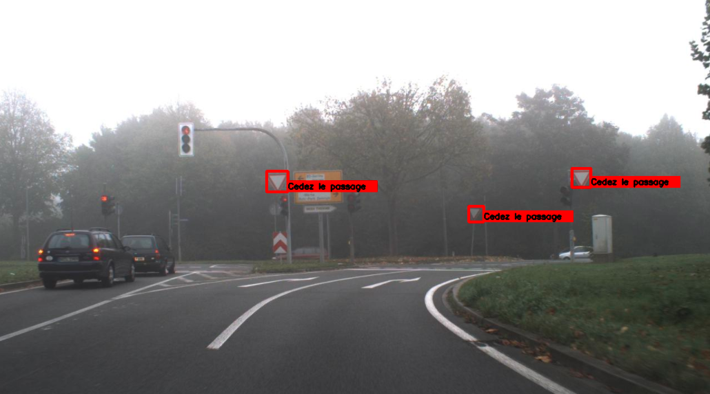

# How we trained a custom traffic signs detection model with Tensorflow Object Detection API

We used this article to understand [how to use TensorFlow API](https://gilberttanner.com/blog/tensorflow-object-detection-with-tensorflow-2-creating-a-custom-model).  

This readme is inspired by the following github repo [README](https://github.com/TannerGilbert/Tensorflow-Object-Detection-API-Train-Model).




### 1. Installation

You can install the TensorFlow Object Detection API either with [Docker](https://www.docker.com/), an open-source platform for deploying and managing containerized applications. The installation could be longer but in the end it will be worth it to install it with Docker.

First clone the master branch of the Tensorflow Models repository:

```bash
git clone https://github.com/tensorflow/models.git
```

#### Docker Installation

First build the Docker package.
```
# From the root of the git repository (inside the models directory)
docker build -f research/object_detection/dockerfiles/tf2/Dockerfile -t od .
```

Then you can run it with this command:
```
docker run -it od
```

#### Protoc Installation

Refer to this [link](https://grpc.io/docs/protoc-installation/) in order to install `protobuf`. (Choose your OS and follow the instructions)

#### Convert proto files to python files

We will use protobuf to convert proto files in `~/models/research/object_detection/protos`.

Create `use_protobuf.py` and copy paste this in the new created python file.

```python
import os
import sys
args = sys.argv
directory = args[1]
protoc_path = args[2]
for file in os.listdir(directory):
    if file.endswith(".proto"):
        os.system(protoc_path+" "+directory+"/"+file+" --python_out=.")
```

Next, we use the script to generate python files with protos files.

- Windows

The path for `<path to protoc file>` is the path where you installed protobuf

```
python use_protobuf.py <path to directory> <path to protoc file>
```

- MacOS & Linux

```
python use_protobuf.py <path to directory> protoc
```

To test the installation run:

```
# Test the installation.
python object_detection/builders/model_builder_tf2_test.py
```

If everything installed correctly you should see something like:

```
...
[       OK ] ModelBuilderTF2Test.test_create_ssd_models_from_config
[ RUN      ] ModelBuilderTF2Test.test_invalid_faster_rcnn_batchnorm_update
[       OK ] ModelBuilderTF2Test.test_invalid_faster_rcnn_batchnorm_update
[ RUN      ] ModelBuilderTF2Test.test_invalid_first_stage_nms_iou_threshold
[       OK ] ModelBuilderTF2Test.test_invalid_first_stage_nms_iou_threshold
[ RUN      ] ModelBuilderTF2Test.test_invalid_model_config_proto
[       OK ] ModelBuilderTF2Test.test_invalid_model_config_proto
[ RUN      ] ModelBuilderTF2Test.test_invalid_second_stage_batch_size
[       OK ] ModelBuilderTF2Test.test_invalid_second_stage_batch_size
[ RUN      ] ModelBuilderTF2Test.test_session
[  SKIPPED ] ModelBuilderTF2Test.test_session
[ RUN      ] ModelBuilderTF2Test.test_unknown_faster_rcnn_feature_extractor
[       OK ] ModelBuilderTF2Test.test_unknown_faster_rcnn_feature_extractor
[ RUN      ] ModelBuilderTF2Test.test_unknown_meta_architecture
[       OK ] ModelBuilderTF2Test.test_unknown_meta_architecture
[ RUN      ] ModelBuilderTF2Test.test_unknown_ssd_feature_extractor
[       OK ] ModelBuilderTF2Test.test_unknown_ssd_feature_extractor
----------------------------------------------------------------------
Ran 20 tests in 91.767s

OK (skipped=1)
```

### 2. Data we used

We found a preprocessed dataset with `900 images` on this [link](https://benchmark.ini.rub.de/gtsdb_dataset.html). We divided the dataset with 750 images for training and 150 images for testing.

If you want to use another dataset, you will have to do the labelling part yourself in order to find ROI for each images.

Labeling is the process of drawing bounding boxes around the desired objects.

LabelImg is a great tool for creating an object detection data-set.

[LabelImg GitHub](https://github.com/tzutalin/labelImg)

[LabelImg Download](https://www.dropbox.com/s/tq7zfrcwl44vxan/windows_v1.6.0.zip?dl=1)

Download and install LabelImg. Then point it to your images/train and images/test directories, and draw a box around each object in each image.

### 3. Generate the TFRecord

#### Setup CSV files
Before creating a record for train and test, you need to set up a `csv` file for each. We used the csv file given with the dataset and changed some things.

We converted each class to `1` because we only want the model to be able to detect traffic sign, not classify them. Then we added `width` & `height` columns with respectively 1360 and 800 (pixels) because all our images have the same sizes.

Finally we divided the file in 2 distinct csv files, `train_labels.csv` and `test_labels.csv` with the 750 first images for training and the last 150 for testing.

#### TFRecord

Open the [generate_tfrecord.py file](generate_tfrecord.py) and replace the labelmap inside the `class_text_to_int` method with only 1 label map.

In order to train the model, you need to generate a TFRecord by typing:

```bash
python generate_tfrecord.py --csv_input=images/train_labels.csv --image_dir=images/train --output_path=train.record
python generate_tfrecord.py --csv_input=images/test_labels.csv --image_dir=images/test --output_path=test.record
```

These two commands generate a train.record and a test.record file, which can be used to train our object detector.

### 4. Create the Labelmap for training

Because we are using 2 different models - One for traffic signs detection, and one for the classification - we have only one category in our labelmap

```python
item {
    id: 1
    name: "Traffic Sign"
}
```

We will put it in a folder called training, which is located in the object_detection directory.    
The id number of each item should match the id of specified in the generate_tfrecord.py file.

### 5. Creating the training configuration

Lastly, we need to create a training configuration file. As a base model, I will use EfficientDet – a recent family of SOTA models discovered with the help of Neural Architecture Search. The Tensorflow OD API provides a lot of different models. For more information check out the [Tensorflow 2 Detection Model Zoo](https://github.com/tensorflow/models/blob/master/research/object_detection/g3doc/tf2_detection_zoo.md)

The [base config](https://github.com/tensorflow/models/blob/master/research/object_detection/configs/tf2/ssd_efficientdet_d0_512x512_coco17_tpu-8.config) for the model can be found inside the [configs/tf2 folder](https://github.com/tensorflow/models/tree/master/research/object_detection/configs/tf2).

Copy the config file to the training directory. Then open it inside a text editor and make the following changes:

* Line 13: change the number of classes to number of objects you want to detect (4 in my case)

* Line 141: change fine_tune_checkpoint to the path of the model.ckpt file:

    * ```fine_tune_checkpoint: "<path>/efficientdet_d0_coco17_tpu-32/checkpoint/ckpt-0"```

* Line 143: Change ```fine_tune_checkpoint_type``` to detection

* Line 182: change input_path to the path of the train.records file:

    * ```input_path: "<path>/train.record"```

* Line 197: change input_path to the path of the test.records file:

    * ```input_path: "<path>/test.record"```

* Line 180 and 193: change label_map_path to the path of the label map:

    * ```label_map_path: "<path>/labelmap.pbtxt"```

* Line 144 and 189: change batch_size to a number appropriate for your hardware, like 4, 8, or 16.

### 6. Training the model

#### Launch the training

To train the model, execute the following command in the command line:

```bash
python model_main_tf2.py \
    --pipeline_config_path=training/ssd_efficientdet_d0_512x512_coco17_tpu-8.config \
    --model_dir=training \
    --alsologtostderr
```

#### Monitoring the training

Every few minutes, the current loss gets logged to Tensorboard. Open Tensorboard by opening a second command line, navigating to the object_detection folder and typing:

```tensorboard --logdir=training/train```

This will open a webpage at localhost:6006.

The training script saves checkpoints about every five minutes. Train the model until it reaches a satisfying loss, then you can terminate the training process by pressing Ctrl+C.

### 7. Exporting the inference graph

Now that we have a trained model, we need to generate an inference graph that can be used to run the model.

```bash
python /content/models/research/object_detection/exporter_main_v2.py \
    --trained_checkpoint_dir training \
    --output_directory inference_graph \
    --pipeline_config_path training/ssd_efficientdet_d0_512x512_coco17_tpu-8.config
```

You can use the inference graph in differents ways.

### 8. Traffic sign classification

Now we have a good traffic sign detection model. We use another CNN model in order to classify the differents traffic signs. You can find the classification model [here](model_classification.ipynb).

Because we have 2 models used to detect and classify each traffic signs, we had to create a script to make them work together. You can find this [here](processing_notebook.ipynb).
